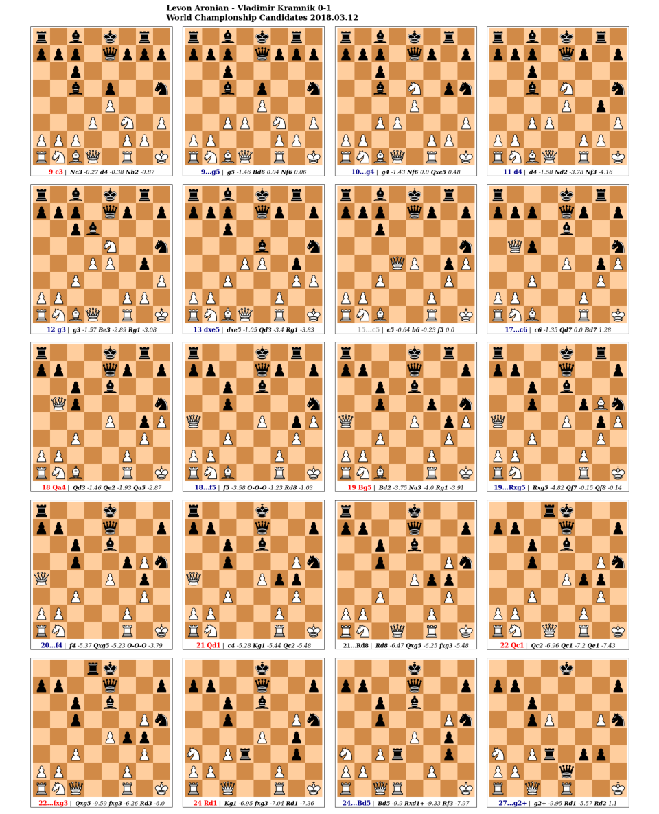

# Ostap

Ostap is a chess game analyzer. It uses the [stockfish chess engine](https://stockfishchess.org) to
analyze all the games of a [PGN](https://en.wikipedia.org/wiki/Portable_Game_Notation) file and 
for each game it emits an html page with diagrams of the interesting positions. Currently it identifies:

- positions with errors i.e the move played is significantly worse that the engine's proposal
- difficult positions i.e the engine evaluation fluctuates and there are moves that give the advantage to either size
- positions where the engine's first move is significantly better than the others.

Here is the ostap output for a [famous game](https://www.chessgames.com/perl/chessgame?gid=1914397&view=1&kpage=11) by 
[Vladimir Kramnik](https://en.wikipedia.org/wiki/Vladimir_Kramnik).



I run ostap on my RPI cluster, constantly feeding it games and checking the output for interesting positions.

Ostap is named after the fictional Russian con man [Ostap Bender](https://en.wikipedia.org/wiki/Ostap_Bender) who pretended
to be a chess GM in one of this adventures. You can read the story [here](http://lib.ru/ILFPETROV/ilf_petrov_12_chairs_engl.txt).
The chess tournament is chapter 34.

## Installation

Ostap is a python applications. It has very few dependencies, namely [stockfish](https://stockfishchess.org),
[python-chess](https://python-chess.readthedocs.io/en/latest/) and [Jinja](https://jinja.palletsprojects.com/en/3.1.x/).
You must have a stockfish executable in your PATH, see the site for instructions. The others are installed by pip.
It needs python >= 3.9. Tested on FreeBSD 14 and Debian 12 with custom stockfish builds.

You did a working python installation. The simplest way is to install python using your OS package managers and then
create a virtual environment to use ostap.

If you don't use python for other things and you want only to run ostap, do the following. It will create a virtual
environment in `${HOME}/src/ostap` and install ostap. You need to activate it before using the program. 

```
cd to your workspace ${HOME}/src
git clone https://github.com/anastasop/ostap
cd ostap
python3 -m venv venv
. ./venv/bin/activate # activation step
pip install .
```

If you are a python user, you can install ostap directly from github 

```
pip install --user git+https://github.com/anastasop/ostap@master
```

Both ways with install the `ostap` executable in your python path.

## Usage

The simplest call is

```
ostap --input-pgn 60_memorable_games.pgn --output-html . --summary-only
``` 

which will analyze the games and output the files

```
60_memorable_games.pgn.01.html
60_memorable_games.pgn.02.html
...
60_memorable_games.pgn.60.html
```

which you can preview with a browser. You can use `python3 -m http.server` to launch a web server and point the browser
to `http://localhost:8080`

For the full options run ostap with `--help`

```
usage: ostap [-h] [--engine ENGINE_PATH] [--engine-threads ENGINE_THREADS] [--engine-hash-tables ENGINE_HASH_TABLES]
             [--analysis-multipv ANALYSIS_MULTIPV] [--analysis-seconds-ply ANALYSIS_SECONDS_PLY] [--analysis-ignore-plies ANALYSIS_IGNORE_PLIES]
             [--threshold-error ANALYSIS_THRESHOLD_ERROR] [--threshold-first-choice ANALYSIS_THRESHOLD_FIRST_CHOICE] --output-html OUTPUT_HTML
             --input-pgn INPUT_PGN [--summary-only]

Ostap is a chess game analyzer on top of stockfish

options:
  -h, --help            show this help message and exit
  --engine ENGINE_PATH  path to stockfish exec
  --engine-threads ENGINE_THREADS
                        threads to use
  --engine-hash-tables ENGINE_HASH_TABLES
                        hash tables size (MB)
  --analysis-multipv ANALYSIS_MULTIPV
                        consider alternative moves
  --analysis-seconds-ply ANALYSIS_SECONDS_PLY
                        time (sec) to analyze each ply
  --analysis-ignore-plies ANALYSIS_IGNORE_PLIES
                        don't analyze the first plies, usually the opening
  --threshold-error ANALYSIS_THRESHOLD_ERROR
                        centipawn score diff for a move to be considered error
  --threshold-first-choice ANALYSIS_THRESHOLD_FIRST_CHOICE
                        centipawn score diff between first and last choice
  --output-html OUTPUT_HTML
                        directory to output the analysis result in html
  --input-pgn INPUT_PGN
                        PGN file with games to analyze
  --summary-only        output only the interesting positions

```

## License

Released under the [GPLv3](https://www.gnu.org/licenses/gpl-3.0.en.html).

## Bugs/TODO

- add an options for naming the html files
- add an options to save the analysis in JSON format
